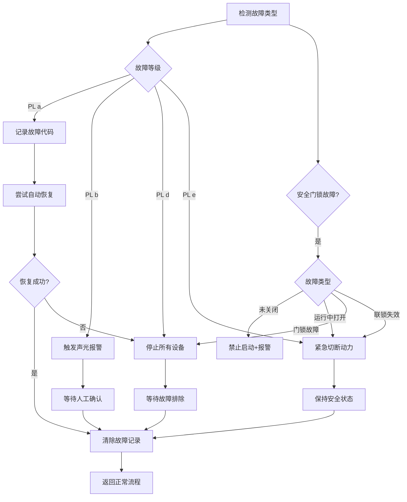
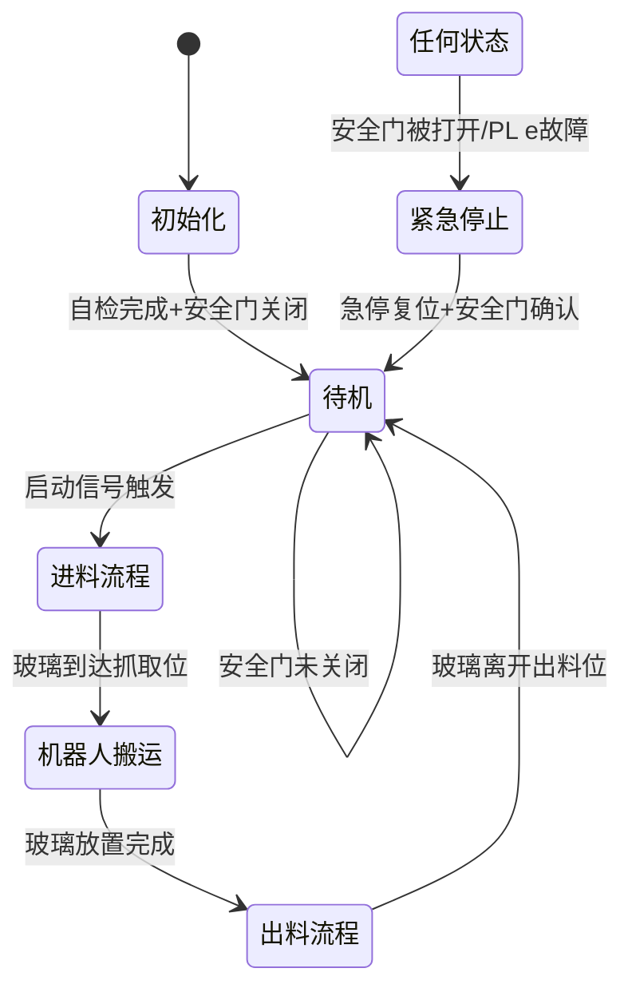

# 自动化玻璃搬送系统电气控制设计方案（第三版）

## 1. 系统概述
本方案针对玻璃自动化搬送系统设计，包含进料输送线、搬运机器人、出料输送线三大核心模块，采用PLC+机器人控制器的分布式控制架构，遵循ISO 13849-1安全标准，实现高效、安全、稳定的玻璃搬运流程。

## 2. 硬件配置清单（新增安全门锁）
| 设备名称 | 型号规格 | 数量 | 功能说明 |
|----------|----------|------|----------|
| PLC控制器 | 西门子S7-1200 | 1 | 系统主控制器 |
| 机器人控制器 | ABB IRC5 | 1 | 机械臂动作控制 |
| 进料输送线 | 定制皮带线 | 1 | 玻璃上料输送 |
| 出料输送线 | 定制皮带线 | 1 | 玻璃下料输送 |
| 光电传感器 | Omron E3Z | 4 | 玻璃位置检测 |
| 限位开关 | Siemens 3SE5 | 6 | 设备位置限位 |
| 急停按钮 | 施耐德XB2 | 3 | 紧急停止控制 |
| 人机界面 | 威纶通MT8102iE | 1 | 操作监控 |
| **安全门锁** | **Schmersal AZM 415** | **2** | **安全门状态检测与锁定** |

## 3. 安全设计（参考ISO 13849-1标准）
### 3.1 安全等级划分（PL等级）
| 安全等级 | 对应ISO PL | 风险等级 | 适用场景 | 处理措施 |
|----------|------------|----------|----------|----------|
| 一级安全 | PL a | 低风险 | 传感器异常、轻微位置偏差 | 自动恢复，记录故障 |
| 二级安全 | PL b | 中风险 | 电机过载、真空度不足 | 停机报警，需人工确认恢复 |
| 三级安全 | PL d | 高风险 | 安全门锁故障、机械卡死 | 紧急停机，强制安全状态 |
| 四级安全 | PL e | 极高风险 | 急停触发、安全门被打开 | 立即切断动力，锁定系统 |

### 3.2 安全门锁故障类型及处理
| 故障类型 | 安全等级 | 触发条件 | 处理流程 |
|----------|----------|----------|----------|
| 安全门未关闭 | PL d | 启动时安全门状态异常 | 禁止启动，声光报警 |
| 安全门运行中打开 | PL e | 运行时安全门信号丢失 | 紧急停机，切断动力 |
| 安全门锁故障 | PL d | 门锁状态信号异常 | 停机报警，需专业维修 |
| 安全门联锁失效 | PL e | 门锁信号与实际状态不符 | 紧急停机，系统锁定 |

## 4. 故障处理流程（新增安全门锁分支）

## 5. 交互逻辑补充（安全门锁部分）
- **安全门锁与PLC交互**：采用安全IO模块通信，实时传输门锁状态（关闭/打开/故障）
- **安全联锁机制**：
  - 安全门未关闭时，禁止启动任何设备
  - 运行中安全门被打开，立即触发紧急停止
  - 安全门锁故障时，系统锁定无法启动
- **恢复流程**：
  - PL d/e故障需人工确认安全状态
  - 安全门锁故障需专业人员复位
  - 紧急停止后需依次复位急停、安全门、系统

## 6. 系统控制流程（强化安全联锁）

## 7. 安全设计验证
1. **联锁测试**：验证安全门状态对系统启动的限制
2. **故障注入**：模拟安全门锁故障，测试系统响应
3. **应急测试**：验证紧急停止的响应时间（≤100ms）
4. **恢复测试**：验证故障恢复流程的正确性