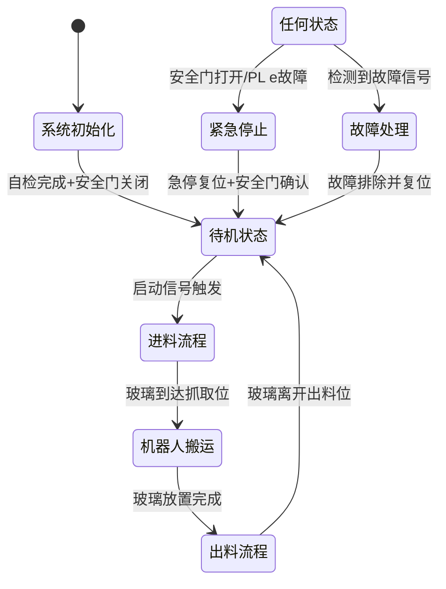
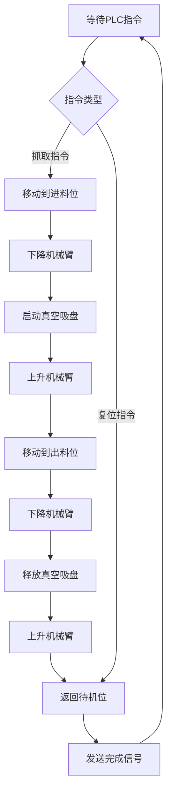
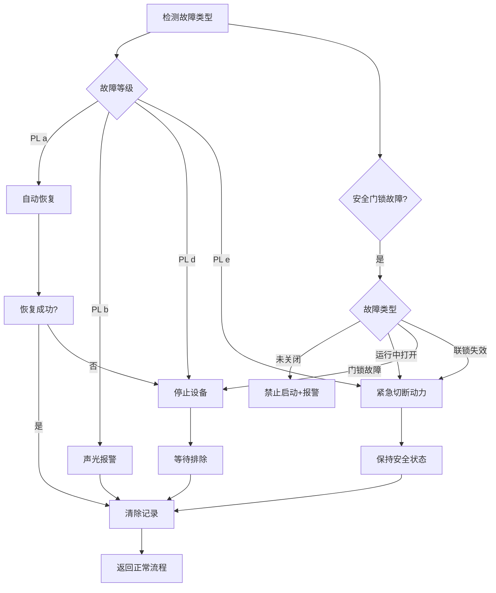

# 自动化玻璃搬送系统电气控制设计方案（最终版）

## 1. 系统概述
本方案针对玻璃自动化搬送系统设计，包含进料输送线、搬运机器人、出料输送线三大核心模块，采用PLC+机器人控制器的分布式控制架构，遵循ISO 13849-1安全标准，实现高效、安全、稳定的玻璃搬运流程。

## 2. 硬件配置清单
| 设备名称 | 型号规格 | 数量 | 功能说明 |
|----------|----------|------|----------|
| PLC控制器 | 西门子S7-1200 | 1 | 系统主控制器 |
| 机器人控制器 | ABB IRC5 | 1 | 机械臂动作控制 |
| 进料输送线 | 定制皮带线 | 1 | 玻璃上料输送 |
| 出料输送线 | 定制皮带线 | 1 | 玻璃下料输送 |
| 光电传感器 | Omron E3Z | 4 | 玻璃位置检测 |
| 限位开关 | Siemens 3SE5 | 6 | 设备位置限位 |
| 急停按钮 | 施耐德XB2 | 3 | 紧急停止控制 |
| 人机界面 | 威纶通MT8102iE | 1 | 操作监控 |
| 安全门锁 | Schmersal AZM 415 | 2 | 安全门状态检测与锁定 |

## 3. 安全设计（ISO 13849-1标准）
### 3.1 安全等级划分
| 安全等级 | ISO PL | 风险等级 | 适用场景 | 处理措施 |
|----------|--------|----------|----------|----------|
| 一级安全 | PL a | 低风险 | 传感器异常、轻微位置偏差 | 自动恢复，记录故障 |
| 二级安全 | PL b | 中风险 | 电机过载、真空度不足 | 停机报警，人工确认恢复 |
| 三级安全 | PL d | 高风险 | 安全门锁故障、机械卡死 | 紧急停机，强制安全状态 |
| 四级安全 | PL e | 极高风险 | 急停触发、安全门打开 | 切断动力，锁定系统 |

### 3.2 安全门锁设计
| 故障类型 | 安全等级 | 触发条件 | 处理流程 |
|----------|----------|----------|----------|
| 安全门未关闭 | PL d | 启动时状态异常 | 禁止启动，声光报警 |
| 运行中打开 | PL e | 运行时信号丢失 | 紧急停机，切断动力 |
| 门锁故障 | PL d | 状态信号异常 | 停机报警，专业维修 |
| 联锁失效 | PL e | 信号与实际不符 | 紧急停机，系统锁定 |

## 4. 完整控制流程图
### 4.1 主控制流程

### 4.2 机器人搬运流程

### 4.3 故障处理流程

## 5. 交互逻辑设计
### 5.1 设备间交互
- **PLC与机器人**：PROFINET通信（100ms周期），传输指令、位置、状态、故障
- **输送线与PLC**：IO信号交互，包括启动/停止、位置检测、状态反馈
- **安全门锁与PLC**：安全IO模块通信，实时传输门锁状态

### 5.2 安全联锁机制
- 安全门未关闭禁止启动
- 运行中安全门打开立即停机
- 故障状态下禁止新动作
- 急停触发切断所有动力

## 6. 系统验证测试
1. **功能测试**：验证各流程逻辑正确性
2. **安全测试**：验证安全联锁和故障响应
3. **性能测试**：验证系统响应时间和稳定性
4. **负载测试**：验证满负荷运行能力
5. **恢复测试**：验证故障恢复流程有效性

## 7. 设计文档版本历史
| 版本 | 更新日期 | 主要变更 |
|------|----------|----------|
| v1.0 | 2025-11-13 | 基础架构与流程图 |
| v2.0 | 2025-11-13 | 详细子流程与故障处理 |
| v3.0 | 2025-11-13 | 安全设计与门锁细化 |
| v4.0 | 2025-11-13 | 最终整合版 |